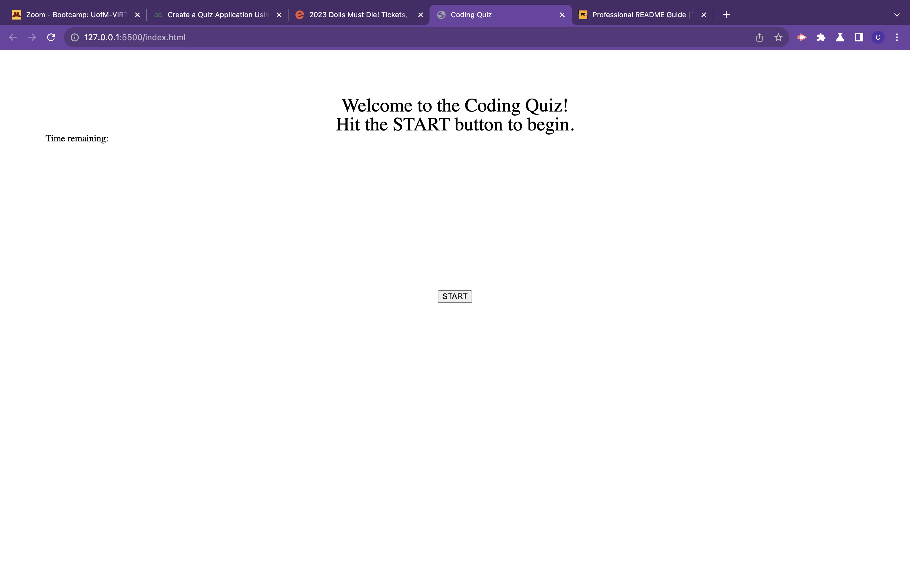
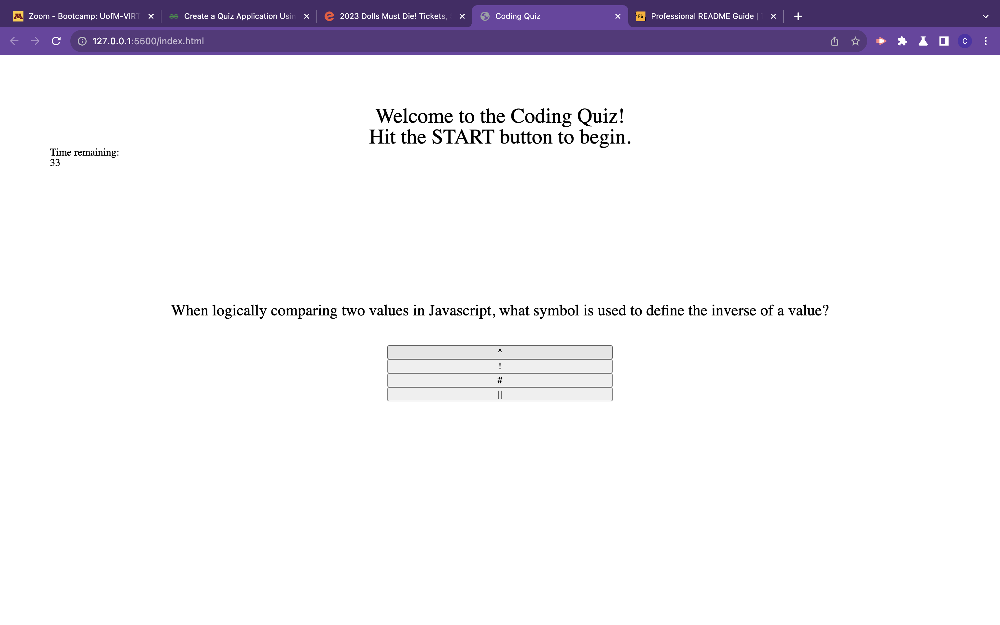

# Coding-Quiz

## Description

This coding quiz was created using HTML, CSS, and JavaScript. It allows a user to test their knowledge on mostly coding content and one question about plants. The quiz helped me understand functions and methods better in JavaScript.

## Installation

N/A

## Usage

### Deployed Site
https://cwhitecoding.github.io/Coding-Quiz/

Click start and begin answering questions by clicking buttons. The wrong answer will subtract 5 seconds from the timer. 
The main page welcomes you and presents the start button:

Continue answering questions by clicking buttons.. but don't forget about the last question!

## Credits

### Eric Sayer: One hour tutor session
### Brennan Mitchell: 45 minute group study session

### CSS Reset from: https://meyerweb.com/eric/tools/css/reset/

## License

N/A

